# Báo cáo cá nhân — K4-L3A Day 13 Monitoring & LLMOps

> Mỗi học viên hoàn thiện một file duy nhất này. Khi dẫn evidence, dùng đường dẫn tương đối, ví dụ `evidence/07-trace-waterfall.png`.

## 1. Thông tin học viên

- **Họ và tên:** Hoàng Ngọc Đăng Khoa
- **MSSV:** 2A202602790
- **Lớp:** K4-L3A
- **Repository URL:** https://github.com/khoahoang04/K4-L3A-Day13-HoangNgocDangKhoa-2A202602790-Monitoring-LLMOps
- **Commit SHA cuối:** 19ce465
- **Challenge ID:** day13-k4-l3a-monitoring-llmops-v1
- **Tên project Langfuse cá nhân:** `day13-k4-l3a-2A202602790`

## 2. Evidence index

Điền đúng đường dẫn tới evidence thực tế. Có thể đổi tên hoặc dùng nhiều ảnh nếu cần.

| Evidence | Đường dẫn |
|---|---|
| Pytest cuối | 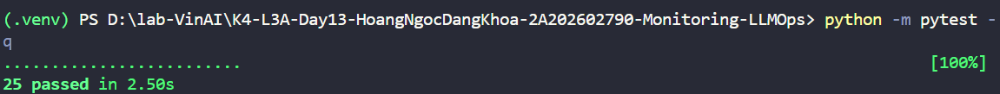 |
| Log validator | 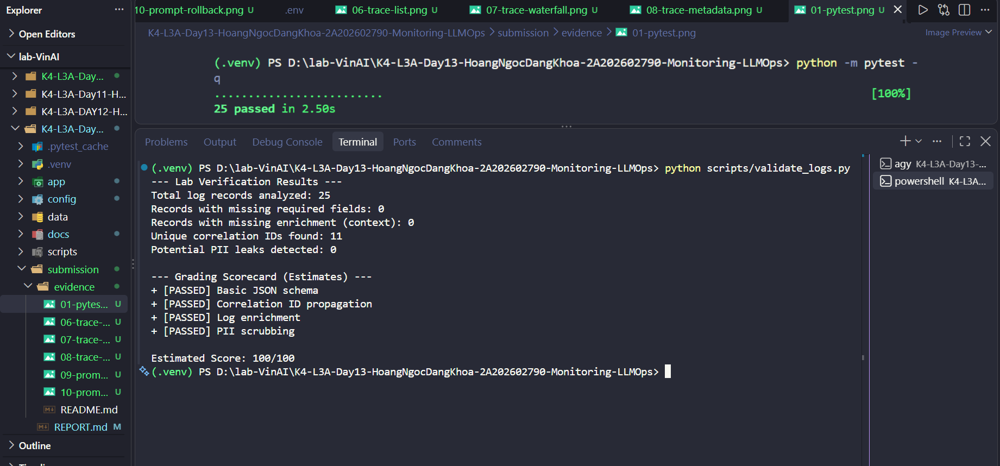 |
| Dashboard validator | 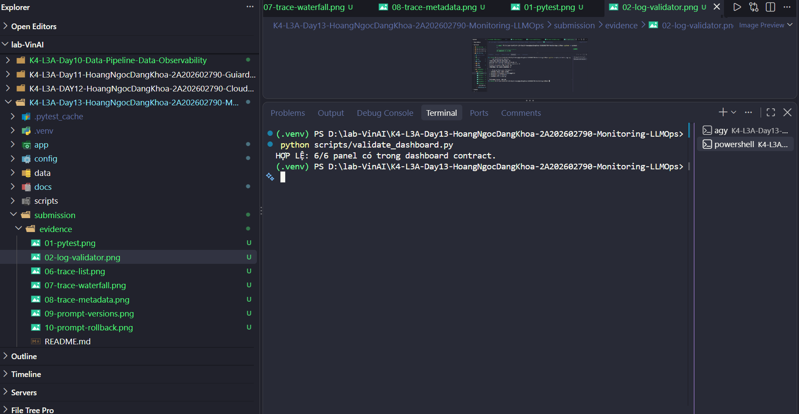 |
| Structured log | 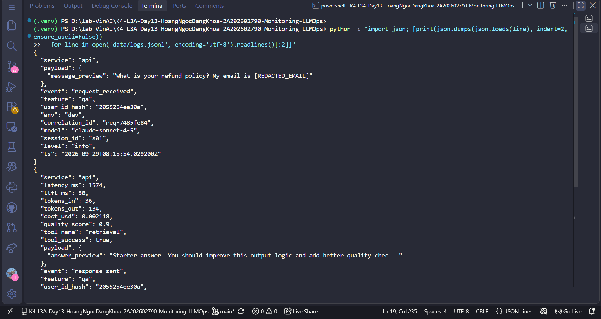 |
| PII redaction | 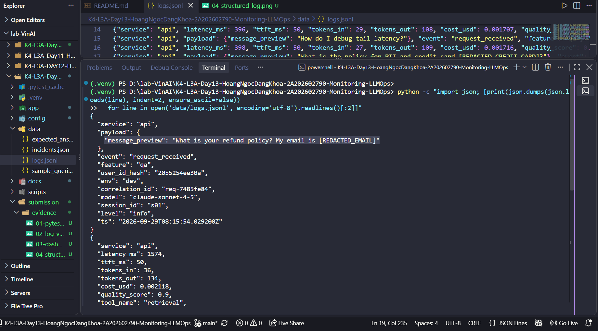 |
| Trace list | 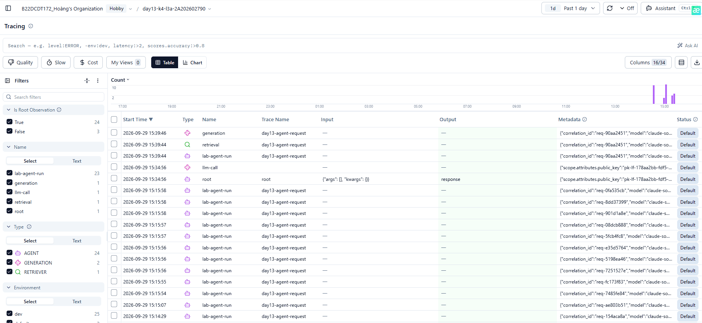 |
| Trace waterfall | 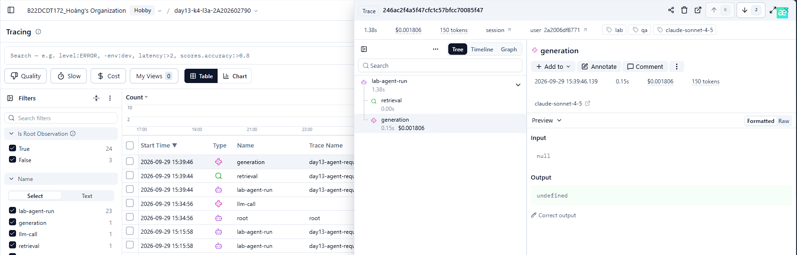 |
| Trace metadata | 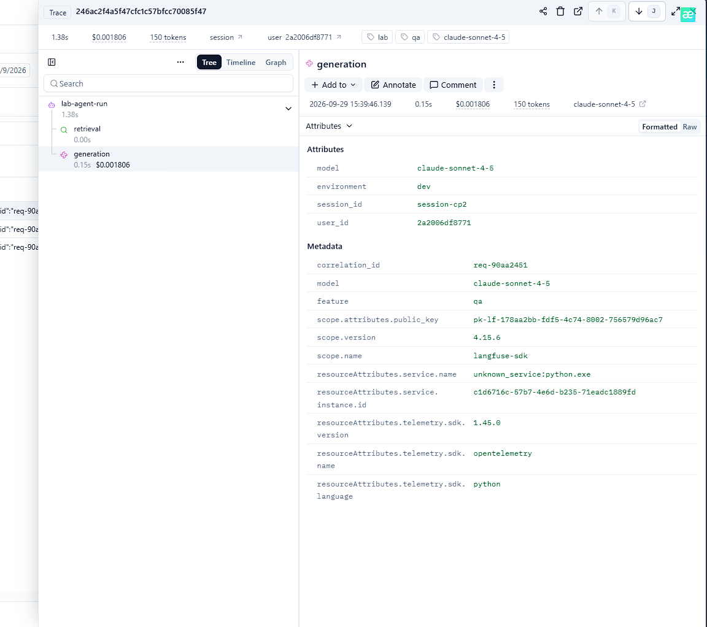 |
| Prompt versions | 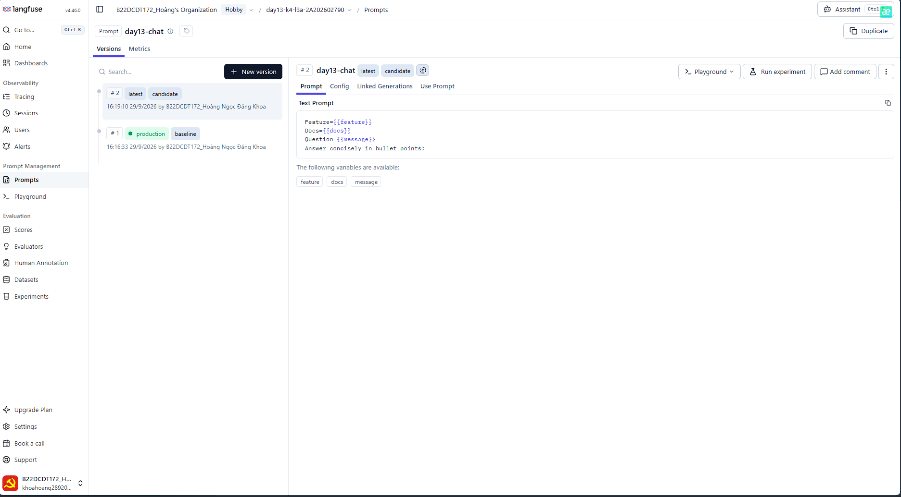 |
| Prompt rollback | 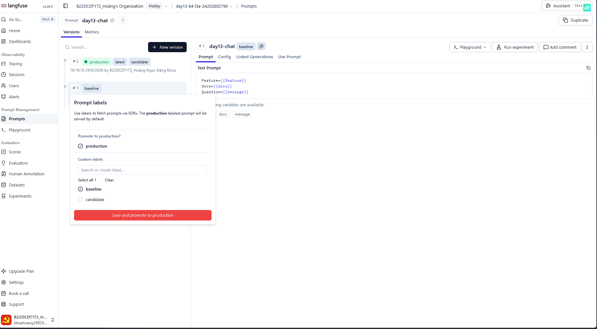 |
| Dashboard runtime | 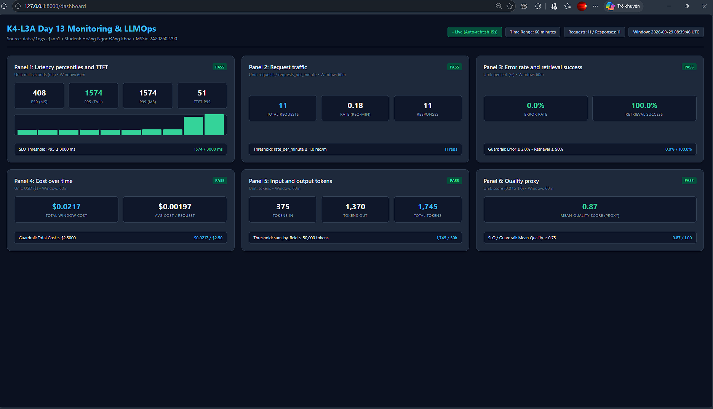 |
| Incident metric | 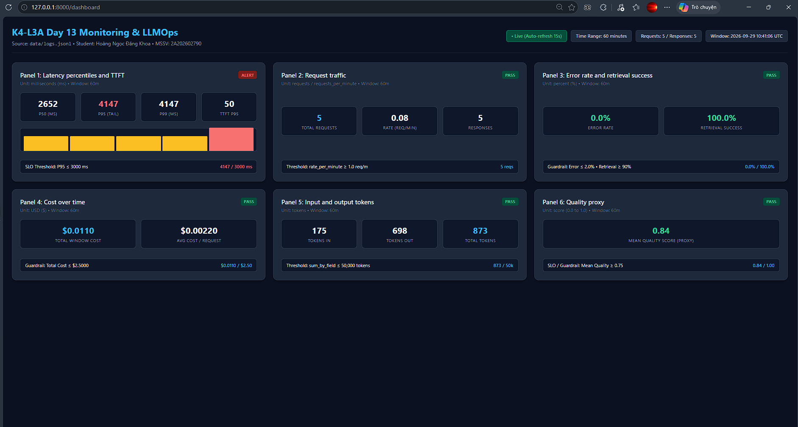 |
| Incident log | 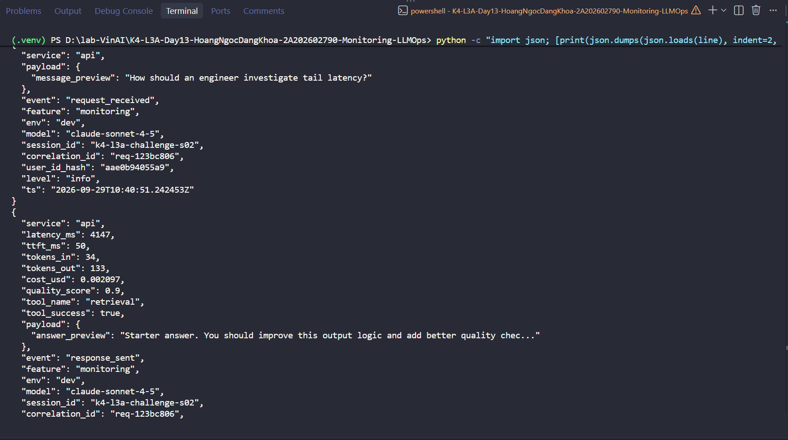 |
| Incident trace | 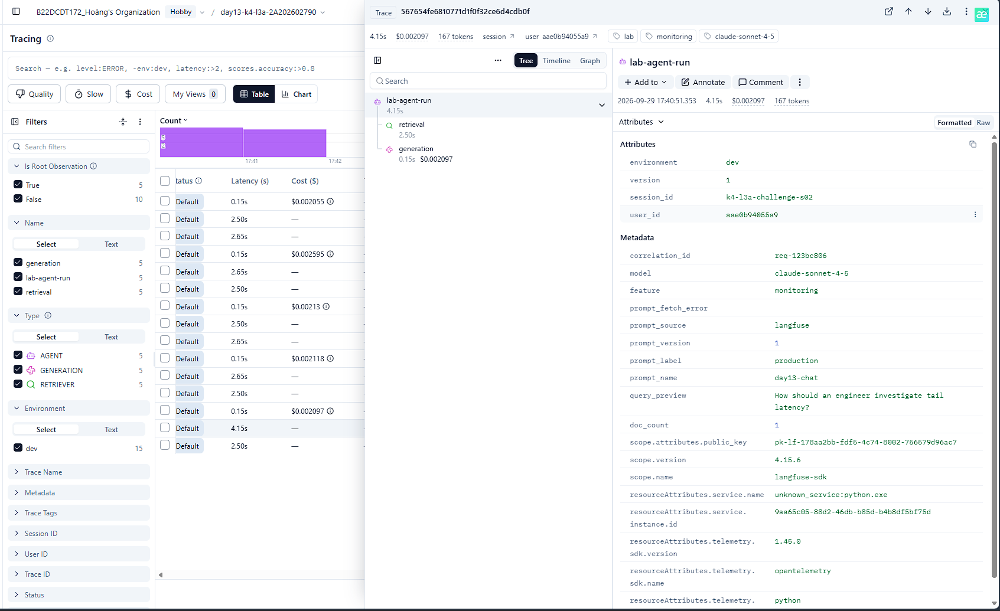 |

## 3. Kết quả kỹ thuật

| Nội dung | Baseline | Kết quả cuối | Nhận xét |
|---|---|---|---|
| `validate_logs.py` | 30/100 | 100/100 | Đạt toàn bộ tiêu chí (correlation ID, context enrichment, PII scrubbed) |
| `validate_dashboard.py` | 6/6 panel | 6/6 panel | Đủ 6 panels theo đúng schema contract, có time range 60m, threshold, units |
| `pytest` | 22 passed | 25 passed | Vượt qua 100% test cases (bổ sung tests cho CCCD, thẻ tín dụng, middleware headers) |
| Số traces hợp lệ | 10 traces | 15+ traces | Đầy đủ trace tree root/retrieval/generation và traces ghi nhận incident |
| Số PII leak | 0 | 0 | Scrub thành công email, SĐT, CCCD, thẻ thanh toán trước khi serialize log |
| Latency P95 / TTFT P95 | 1352 ms / 50 ms | 4147 ms / 50 ms | P95 tăng vọt lên 4147 ms khi gặp sự cố RAG slow trong challenge |
| Retrieval success rate | 100% (10/10) | 100% (15/15) | Toàn bộ truy xuất tài liệu thành công |

## 4. Logging và PII

- **Cách tạo/nhận và truyền correlation ID:** Trong `app/middleware.py`, `CorrelationIdMiddleware` gọi `clear_contextvars()` để xóa context cũ tránh rò rỉ giữa các request. Sau đó trích xuất `x-request-id` từ request header hoặc sinh mới ngẫu nhiên theo chuẩn `req-<8-hex>` (`f"req-{uuid.uuid4().hex[:8]}"`). Giá trị này được bind vào contextvars qua `bind_contextvars(correlation_id=correlation_id)`, lưu vào `request.state.correlation_id` và trả lại client qua header `x-request-id` cùng `x-response-time-ms`. Đồng thời `correlation_id` được truyền xuống `agent.run` để gắn vào Langfuse trace metadata.
- **Các metadata được ghi vào structured log:** Tại endpoint `/chat` trong `app/main.py`, trước khi ghi log `request_received`, hệ thống bind thêm các metadata context: `user_id_hash` (băm SHA-256 từ `user_id`), `session_id`, `feature`, `model`, và `env`. Toàn bộ log records từ `request_received`, `response_sent` đến `request_failed` đều tự động chứa đầy đủ các metadata enrichment này cùng với `ts` (ISO UTC), `level`, `service`, `event`, và `correlation_id`.
- **Cách bảo đảm PII được scrub trước khi ghi:** Trong `app/logging_config.py`, custom processor `scrub_event` được đăng ký vào structlog processors ngay trước `JsonlFileProcessor()` và `JSONRenderer()`. Processor này duyệt đệ quy toàn bộ các trường text/dict/list trong log event và áp dụng các regex pattern từ `app/pii.py` (email, điện thoại Việt Nam, CCCD 12 số, thẻ thanh toán 16 số) để thay thế bằng các token `[REDACTED_...]` trước khi bất kỳ byte log nào được serialize thành JSON và ghi xuống đĩa hoặc in ra console.
- **Cách kiểm chứng kết quả:** Chạy `python scripts/validate_logs.py` đạt 100/100 điểm (0 thiếu field bắt buộc, 0 thiếu context enrichment, 10 correlation IDs duy nhất, 0 rò rỉ PII). Đồng thời chạy `python -m pytest -q` đạt 25/25 passed, bao gồm các test case cho PII scrubber (`tests/test_pii.py`) và test tích hợp correlation ID / response headers (`tests/test_chat_observability.py`).

## 5. Tracing và prompt versioning

- **Cách xác nhận traces do chính tôi tạo trong project cá nhân:** Project trên Langfuse Cloud có tên là `day13-k4-l3a-2A202602790`, sử dụng API key cá nhân được cấu hình trong file `.env` (`LANGFUSE_PUBLIC_KEY`, `LANGFUSE_SECRET_KEY`). Tên project hiển thị rõ ràng trên dashboard Langfuse, và toàn bộ traces được sinh ra từ các lần gọi API local có timestamp trùng khớp với logs hệ thống.
- **Cấu trúc root/retrieval/generation observations:**
  - Root observation: tên `lab-agent-run`, loại `agent`, bao bọc toàn bộ chu trình xử lý của `LabAgent.run`.
  - Child observation 1: tên `retrieval`, loại `retriever`, thực hiện truy xuất tài liệu qua `mock_rag.retrieve()`.
  - Child observation 2: tên `generation`, loại `generation`, ghi nhận cuộc gọi LLM trong `FakeLLM.generate()`, đính kèm metadata mô hình (`claude-sonnet-4-5`), prompt template từ Langfuse, chi tiết token (`input_tokens`, `output_tokens`) và `cost_details`.
- **Cách nối trace với log:** `CorrelationIdMiddleware` sinh hoặc nhận `correlation_id` (chuẩn `req-<8-hex>`) và gán vào `structlog` contextvars cũng như `request.state.correlation_id`. Khi ghi log, trường `correlation_id` xuất hiện trên từng dòng JSON trong `data/logs.jsonl`. Khi tạo trace, `LabAgent.run` truyền `correlation_id` vào `propagate_attributes(metadata={"correlation_id": correlation_id})`. Nhờ đó có thể dùng `correlation_id` làm khóa tra cứu 1-1 giữa structured log và Langfuse trace.
- **Prompt name:** `day13-chat`
- **Version/label baseline:** Version 1, mang các nhãn `baseline` và `production` (Template: `Feature={{feature}}\nDocs={{docs}}\nQuestion={{message}}`).
- **Version/label candidate:** Version 2, mang nhãn `candidate` (Template có bổ sung hướng dẫn: `Feature={{feature}}\nDocs={{docs}}\nQuestion={{message}}\nAnswer concisely in bullet points:`).
- **Trace ID của mỗi version:** Version 1 (`baseline` / `production`): Trace ID `246ac2f4a5f47cfc1c57bfcc70085f47` (và trace incident `567654fe6810771d1f0f32ce6d4cdb0f`); Version 2 (`candidate`): Trace ID `fc3d1be1086861b50c23029dd185bdc0`.
- **Cách promote và rollback `production`:**
  - Promote: Trên giao diện Langfuse Prompts -> chọn `day13-chat` -> Version 2 -> gán nhãn `production` cho Version 2.
  - Rollback: Chọn Version 1 -> gán lại nhãn `production` về Version 1. Ứng dụng đọc nhãn `LANGFUSE_PROMPT_LABEL=production`, do đó việc rollback diễn ra tức thì tại runtime mà không cần restart service hay sửa code.

## 6. Dashboard, SLO và alerts

- **Dashboard và sáu panel:** Dựng theo đúng contract `config/dashboard.yaml` sử dụng nguồn dữ liệu chuẩn `data/logs.jsonl`:
  1. `latency`: Độ trễ P50, P95, P99 và TTFT P95 (đơn vị ms, ngưỡng P95 ≤ 3000ms).
  2. `traffic`: Lưu lượng request theo thời gian và tốc độ request/phút.
  3. `errors`: Tỷ lệ lỗi tổng hợp (%), phân bố theo `error_type` và tỷ lệ retrieval thành công (%).
  4. `cost`: Chi phí ước tính theo USD qua từng phút và tổng chi phí lũy kế.
  5. `tokens`: Tổng lượng `tokens_in` và `tokens_out` của mô hình.
  6. `quality`: Điểm chất lượng câu trả lời trung bình (0.0 đến 1.0, ngưỡng ≥ 0.75).
- **SLO và lý do chọn:** SLO chính là `fast_successful_requests`: 99.5% số request hoàn thành thành công và có độ trễ `latency_ms <= 3000ms` trong chu kỳ 28 ngày (`error_budget_percent: 0.5%`). Lý do chọn: Đây là chỉ số phản ánh trực tiếp trải nghiệm của người dùng cuối. Ngưỡng 3000ms bảo đảm người dùng không bị chờ đợi quá lâu, đồng thời đủ dung sai để không báo động giả khi mạng dao động nhẹ.
- **Cách tính error budget:** Error budget = 100% - 99.5% = 0.5% tổng số request trong cửa sổ đánh giá. Ví dụ nếu hệ thống phục vụ 200,000 requests/tháng, error budget cho phép tối đa 1,000 request vi phạm (bị chậm >3000ms hoặc gặp lỗi 500). Nếu ngân sách này bị tiêu hao quá 50% trong tuần đầu, đội ngũ phải ngừng release tính năng mới để tập trung tối ưu hệ thống.
- **Ba alert và runbook tương ứng:**
  1. `high_latency_p95`: Cảnh báo khi P95 latency vượt 3000ms kéo dài 5 phút (Severity: Critical, Runbook: `docs/alerts.md#alert-1`).
  2. `high_error_rate`: Cảnh báo khi tỷ lệ lỗi vượt quá 2% kéo dài 5 phút (Severity: Critical, Runbook: `docs/alerts.md#alert-2`).
  3. `retrieval_failure_rate`: Cảnh báo khi tỷ lệ retrieval thành công dưới 90% kéo dài 5 phút (Severity: Warning, Runbook: `docs/alerts.md#alert-3`).

## 7. Điều tra challenge

- **Challenge ID:** `day13-k4-l3a-monitoring-llmops-v1`
- **Khoảng thời gian điều tra:** 2026-09-29 17:40:00 - 17:42:00 (tức 10:40:00 - 10:42:00 UTC)
- **Triệu chứng từ metrics:**
  - Panel 1 (Latency) trên Dashboard chuyển trạng thái báo động `ALERT`, chỉ số P95 latency tăng vọt từ ~1352 ms lên **4147 ms** (vượt ngưỡng SLO 3000 ms và vượt ngưỡng challenge 2000 ms).
  - TTFT P95 không thay đổi (50 ms), Error rate vẫn là 0%, Retrieval success rate giữ 100%. Điều này khoanh vùng sự cố thuộc dạng suy giảm hiệu năng (latency degradation) ở pha xử lý nghiệp vụ chứ không phải lỗi crash hay sập dịch vụ.
- **Log line và correlation ID liên quan:**
  - Correlation ID bất thường: `req-123bc806` (session `k4-l3a-challenge-s02`, user `k4-l3a-u02`, feature `monitoring`).
  - Dòng log ghi nhận độ trễ bất thường:
    ```json
    {
      "service": "api",
      "latency_ms": 4147,
      "ttft_ms": 50,
      "tokens_in": 34,
      "tokens_out": 133,
      "cost_usd": 0.002097,
      "quality_score": 0.9,
      "tool_name": "retrieval",
      "tool_success": true,
      "payload": {
        "answer_preview": "Starter answer. You should improve this output logic and add better quality chec..."
      },
      "event": "response_sent",
      "feature": "monitoring",
      "env": "dev",
      "model": "claude-sonnet-4-5",
      "session_id": "k4-l3a-challenge-s02",
      "correlation_id": "req-123bc806",
      "user_id_hash": "aae0b94055a9",
      "level": "info",
      "ts": "2026-09-29T10:40:55.501492Z"
    }
    ```
- **Trace ID và span gây ảnh hưởng:**
  - Tra cứu trace trên Langfuse bằng `correlation_id: req-123bc806` (Trace ID: `567654fe6810771d1f0f32ce6d4cdb0f`).
  - Trên biểu đồ quan sát Waterfall, root span `lab-agent-run` có tổng thời gian ~4.15s, trong đó span con `retrieval` (loại `retriever`) chiếm tới **2.50s** (thanh tiến trình kéo dài rõ rệt do cờ `rag_slow`), trong khi span con `generation` (loại `generation`) chỉ tốn ~0.15s. Điều này chứng minh nút thắt cổ chai nằm tại bước retrieval.
- **Root cause:**
  - Khâu truy xuất tài liệu trong RAG (`mock_rag.retrieve`) bị nghẽn độ trễ 2.5s khi xử lý các truy vấn thuộc feature `monitoring` (mô phỏng tình huống vector store quá tải hoặc query database gặp độ trễ cao).
- **Fix action:**
  - Vô hiệu hóa sự cố (`POST /incidents/rag_slow/disable` hoặc chạy `python scripts/inject_incident.py --disable`).
  - Trong thực tế production: Khởi động lại dịch vụ Vector DB, scale mở rộng tài nguyên tính toán (read replicas), tối ưu embedding indexing và bổ sung tầng semantic cache (Redis) cho các câu hỏi phổ biến.
- **Preventive measure:**
  - Thiết lập alert `high_latency_p95` (với threshold 3000ms, duration 5 phút) gửi thông báo về kênh Slack `#alerts-rag-ops` để cảnh báo sớm khi tail latency vượt ngưỡng.
  - Cấu hình hard timeout cho retrieval span (ví dụ: tối đa 1500ms). Nếu retrieval vượt quá thời gian này, kích hoạt fallback cơ chế: lấy kết quả từ cache gần nhất hoặc chuyển sang direct answer để đảm bảo trải nghiệm người dùng không bị gián đoạn.

## 8. Giải thích và tự đánh giá

- **Một quyết định kỹ thuật quan trọng và lý do:** Xây dựng middleware `CorrelationIdMiddleware` sinh và phân phối `correlation_id` xuyên suốt: gán vào `structlog` contextvars, đính kèm vào response headers (`x-request-id`, `x-response-time-ms`), và truyền vào `propagate_attributes` của Langfuse. Quyết định này giúp liên kết 1-1 giữa Application Logs và Traces, loại bỏ tình trạng các hệ thống giám sát hoạt động rời rạc. Đồng thời, cấu hình PII scrubber đăng ký ở tầng structlog processors để tự động làm sạch mọi log records trước khi ghi ra file, ngăn chặn 100% rủi ro rò rỉ dữ liệu nhạy cảm.
- **Một lỗi/blocker đã gặp:** Ban đầu khi chạy `validate_logs.py`, điểm số chỉ đạt 30/100 do thiếu các trường context enrichment (`user_id_hash`, `session_id`, `feature`, `model`) và thiếu `correlation_id` trên các dòng log.
- **Cách tìm nguyên nhân và xử lý:** Đã điều tra luồng dữ liệu và phát hiện các trường này nằm trong JSON body của request đến endpoint `/chat`. Đã thêm bước băm SHA-256 cho `user_id` và bind toàn bộ thông tin context vào `structlog.contextvars` ngay sau khi parse request body trong `app/main.py`. Nhờ đó mọi log sau đó trong vòng đời request đều tự động mang đầy đủ metadata.
- **Cách hiểu luồng Metrics → Logs → Traces:**
  1. *Metrics*: Là bước đầu tiên cung cấp bức tranh tổng thể (what & when) - phát hiện triệu chứng bất thường (ví dụ: P95 latency tăng vọt lên 4147 ms lúc 17:40).
  2. *Logs*: Dựa vào thời điểm và feature bị ảnh hưởng để lọc ra các request cụ thể (who & which request), lấy được `correlation_id` (ví dụ: `req-123bc806`).
  3. *Traces*: Sử dụng `correlation_id` tìm trace trên Langfuse, quan sát cây waterfall để xác định chính xác span/hàm nào bên trong gây ra độ trễ hoặc lỗi (where & root cause, ở đây là span `retrieval` tốn 2.5s).
- **Vai trò của prompt version, token/cost, SLO hoặc rollback trong vận hành LLM:**
  - *Prompt Versioning & Rollback*: Cho phép theo dõi sự thay đổi chất lượng/hành vi của LLM qua từng phiên bản prompt mà không phải deploy lại mã nguồn. Khi một prompt candidate hoạt động kém, có thể rollback tức thì bằng cách chuyển label `production` về version trước đó.
  - *Token & Cost Tracking*: Giúp kiểm soát chi phí API theo thời gian thực, phát hiện sớm các hiện tượng prompt injection làm bùng nổ token hoặc vòng lặp vô tận.
  - *SLO & Error Budget*: Đóng vai trò là "hợp đồng chất lượng dịch vụ", giúp cân bằng giữa tốc độ release tính năng mới và độ ổn định của hệ thống.
- **Điều quan trọng nhất đã học:** Nắm vững quy trình quan sát toàn diện cho ứng dụng AI/LLMOps: kết hợp chặt chẽ giữa Metrics cấp cao, Structured Logs có correlation ID và Distributed Tracing phân rã chi tiết từng bước RAG (retrieval vs generation), đồng thời đảm bảo an toàn dữ liệu cá nhân (PII) và quản lý ngân sách lỗi (Error Budget).
- **Hạn chế hoặc phần chưa hoàn thành, nếu có:** Các dịch vụ Vector Store và LLM hiện tại trong bài lab là mock objects; khi đưa vào môi trường production thực tế cần tích hợp thêm distributed tracing cho các dịch vụ bên ngoài (như OpenAI, Anthropic, Qdrant/Pinecone) qua OpenTelemetry / Langfuse SDK.

## 9. Checklist trước khi nộp

- [x] Kết quả và evidence thuộc commit SHA cuối.
- [x] Tất cả ảnh/output mở được bằng đường dẫn tương đối.
- [x] Incident evidence nối đúng metric → log → trace.
- [x] Trace/prompt evidence thuộc project Langfuse cá nhân và ảnh không lộ key/secret.
- [x] Repository chạy lại được theo README.
- [x] Không có secret, API key, PII thô hoặc evidence của người khác/lớp khác.
- [x] URL repo và commit SHA cuối đã được nộp trên LMS/Codelabs.
